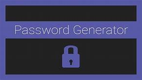

# password-generator

This application will help you with those pesky password requirements. Whether your pass needs special characters, uppercase letters, or numbers we got you covered. 
Or if your password only requires letters and no special characters we got you. Any which way you would like your password displayed. WE GOT YOU!

This app will generate a random passsword for you in a multitude of ways. You can distinguish the length between 8 and 128 characters. You can choose if you want uppercase letters only, lowercase only, and a mixture of both.
If you would like to add numbers to your password to add complexity you can. And to take it to the next level of security special characters such as '@' and '$' can be added to provide the highest level secure password.

Please check out password-generator for all your ppassword needs.
url https://todd1terry1.github.io/password-generator/

